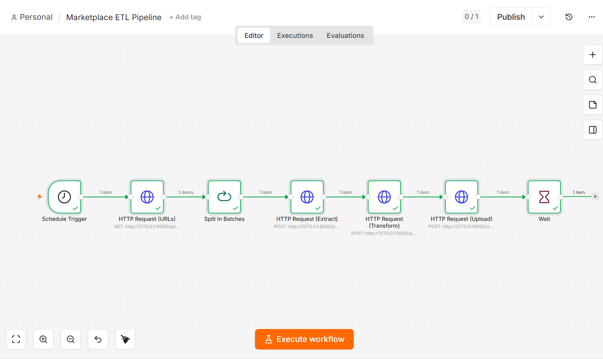
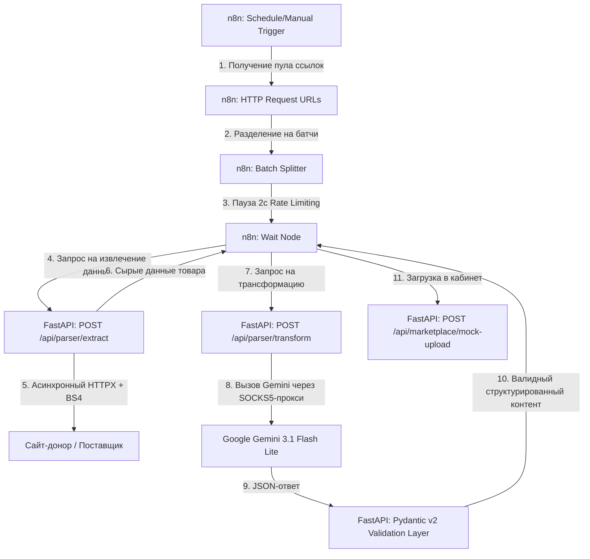

<p align="center">
  
</p>

<div align="center">
  
  
  
  
  
</div>

<div align="center">
  <a href="https://github.com/lazmaksim2019-ops/marketplace-etl-pipeline/actions"></a>
  <a href="https://codecov.io/gh/lazmaksim2019-ops/marketplace-etl-pipeline"></a>
  <a href="https://github.com/lazmaksim2019-ops/marketplace-etl-pipeline"></a>
  
  
</div>

<h1 align="center">
  🤖 Асинхронный ИИ-Парсер каталогов и ETL-конвейер для маркетплейсов
</h1>

<p align="center">
  <b>Промышленный отказоустойчивый B2B-пайплайн автоматизации e-commerce.</b>
  Сквозная интеграция n8n + Python (FastAPI) + Google Gemini API
  для массового импорта и ИИ-уникализации контента.
</p>

> **⚡ Ключевая бизнес-ценность:** Автоматизирует рутину контент-менеджеров по переносу товаров от поставщиков или конкурентов. Система берет на себя парсинг, обход блокировок, глубокий рерайт (удаление чужих брендов, SEO-насыщение) и подготовку валидных данных для загрузки в маркетплейс в один клик.

---

## 🏗 Архитектура (System Design)

Пайплайн спроектирован по канонам событийно-ориентированной архитектуры (EDA) с разделением ответственности: n8n отвечает за оркестрацию и временные задержки, а FastAPI-бэкенд — за вычислительные процессы (парсинг) и бизнес-логику ИИ-валидации.



---

## 💎 Промышленные B2B-стандарты

### Rate Limiting & Safety
Данные разбиваются на изолированные батчи по **1 товару**. Между батчами — задержка **2 секунды** (Wait Node n8n), что гарантирует отсутствие блокировки по HTTP 429.

### Error Isolation
Сбой при парсинге одной битой ссылки или таймаут Gemini не останавливают весь конвейер. `continueOnFail: true` в n8n + логирование ошибок на стороне FastAPI.

### SOCKS5/HTTP-прокси
Встроенная поддержка прокси для стабильного доступа к Gemini API из инфраструктуры РФ. Прокси автоматически прокидываются как в `httpx.AsyncClient`, так и в SDK Gemini.

### Pydantic v2 Validation
Жёсткая валидация схемы ответа перед отправкой в маркетплейс исключает «галлюцинации» языковых моделей:

```python
class CleanProductData(BaseModel):
    original_sku: str
    clean_title: str
    clean_description: str
    extracted_specs: dict
    media_urls: list[str]
```

---

## 📡 API Endpoints

| Метод | Эндпоинт | Описание | Вход | Выход |
|-------|----------|----------|------|-------|
| `GET` | `/health` | Статус бэкенда и Gemini | — | `{"status": "ok"}` |
| `POST` | `/api/parser/extract` | Парсинг страницы товара-донора | `{"url": "string"}` | `RawProductData` |
| `POST` | `/api/parser/transform` | SEO-рерайт через Gemini | `RawProductData` | `CleanProductData` |
| `POST` | `/api/marketplace/mock-upload` | Симуляция выгрузки в маркетплейс | `CleanProductData` | `UploadResponse` |

### Бортовые логи сервера

```text
2026-05-27 09:47:14 [INFO]  Marketplace ETL Pipeline starting up…
2026-05-27 09:47:14 [INFO]  Gemini: gemini-3.1-flash-lite | available: True
2026-05-27 09:48:01 [INFO]  === EXTRACT === https://books.toscrape.com/...
2026-05-27 09:48:01 [INFO]  Extract done: sku=SKU-260527-DF2Y85 title=Ноутбук Sony Model 5312
2026-05-27 09:48:02 [INFO]  === TRANSFORM === sku=SKU-260527-DF2Y85
2026-05-27 09:48:03 [INFO]  Upload success: marketplace_id=wb_3492239
```

---

## 🛠 Технологический стек

| Компонент | Технология | Назначение |
|-----------|------------|-----------|
| **Оркестратор** | n8n (Self-hosted) | Визуальное проектирование сценариев, батчинг, очередь |
| **Бэкенд** | Python 3.12 / FastAPI / Uvicorn | Асинхронная обработка запросов |
| **ИИ-ядро** | Google Gemini 3.1 Flash Lite | Структурированная JSON-генерация контента |
| **Парсинг** | BeautifulSoup4 / httpx / lxml | Асинхронный парсинг с пулом соединений |
| **Валидация** | Pydantic v2 | Строгие B2B-схемы на входе и выходе |
| **Тесты** | pytest / pytest-asyncio / httpx | Интеграционные тесты API |
| **CI/CD** | GitHub Actions | Lint → Test → Coverage → Build |
| **Контейнеризация** | Docker / multi-stage | Лёгкий деплой (финальный образ ~130 MB) |

---

## 💻 Быстрый старт

```bash
# 1. Клонирование
git clone https://github.com/lazmaksim2019-ops/marketplace-etl-pipeline.git
cd marketplace-etl-pipeline

# 2. Окружение
python -m venv .venv
source .venv/bin/activate      # Linux/macOS
# .venv\Scripts\activate       # Windows

# 3. Зависимости
pip install -r requirements.txt
pip install pytest pytest-asyncio httpx  # для тестов

# 4. Настройка
cp .env.example .env
# Заполните GEMINI_API_KEY и PROXY_* в .env

# 5. Запуск
uvicorn main:app --host 0.0.0.0 --port 8000 --reload

# 6. Тесты
pytest -v --cov=. --cov-report=term
```

### Через Docker

```bash
docker build -t marketplace-etl-pipeline .
docker run -p 8000:8000 --env-file .env marketplace-etl-pipeline
```

### Импорт n8n-сценария
1. Запустите n8n (локально или в облаке).
2. Создайте новый Workflow.
3. Откройте `marketplace_pipeline.json`, скопируйте содержимое.
4. Вставьте на холст n8n — **Ctrl+V** (**Cmd+V**). Пайплайн импортируется автоматически!

---

## 📁 Структура репозитория

```
marketplace-etl-pipeline/
├── .github/workflows/ci.yml   # CI/CD конвейер
├── .dockerignore               # Исключения для Docker
├── .env.example                # Шаблон переменных окружения
├── .gitignore                  # Игнорируемые файлы
├── pyproject.toml              # Конфиг ruff, pytest, coverage
├── Dockerfile                  # Multi-stage сборка
├── README.md                   # Документация
├── rules.md                    # Протокол разработки ETL
├── requirements.txt            # Python-зависимости
├── main.py                     # FastAPI сервер (точка входа)
├── models.py                   # Pydantic v2 схемы данных
├── marketplace_pipeline.json   # n8n workflow
├── tests/                      # Тесты
│   ├── __init__.py
│   └── test_main.py
└── assets/
    └── pipeline_schema.png     # Архитектура пайплайна
```

---

## 🔄 Workflow CI/CD

| Этап | Команда | Описание |
|------|---------|----------|
| Lint | `ruff check . && ruff format --check .` | Статический анализ кода |
| Test | `pytest -v --cov=. --cov-report=xml --cov-report=term` | 15+ тестов с покрытием |
| Build | `docker build -t marketplace-etl-pipeline .` | Проверка сборки Docker |

---

## 📄 Лицензия

Распространяется под лицензией **MIT**.

---

---

## 👨‍💻 Автор

**Александр Лазаренко** — Fullstack / AI Developer (React + FastAPI + TypeScript + Python)

[](https://t.me/lazalex81)
[](mailto:lazalex81@gmail.com)
[](https://github.com/lazmaksim2019-ops)
