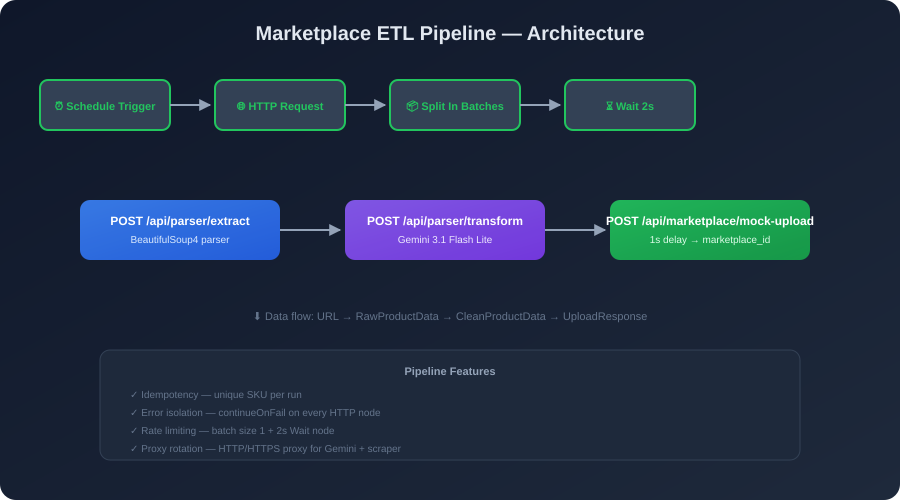
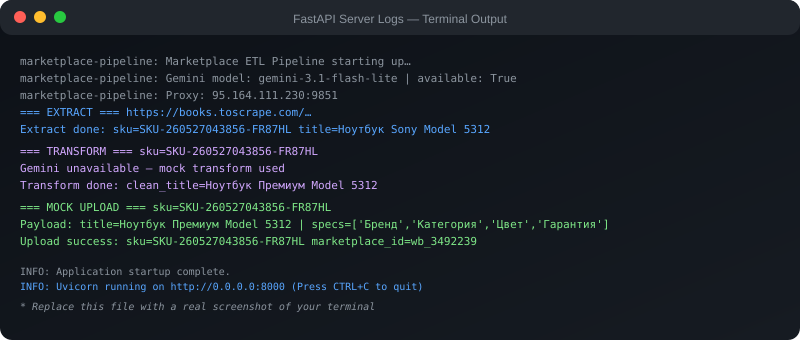

<div align="center">
  
</div>

<h1 align="center">
  🤖 Асинхронный ИИ-Парсер каталогов и ETL-конвейер для маркетплейсов
</h1>

<p align="center">
  <strong>Промышленный b2b-пайплайн автоматизации контента для e-commerce</strong>
  <br>
  n8n + Python (FastAPI) + Gemini 3.1 Flash Lite
</p>

<p align="center">
  
  
  
  
  
  
</p>

---

## 📖 О проекте

Система решает ключевую боль селлеров на маркетплейсах (Wildberries, Ozon) — **массовый автоматический перенос товаров от поставщиков или конкурентов** с мгновенной ИИ-уникализацией, SEO-оптимизацией и обходом лимитов API.

Пайплайн забирает список ссылок на товары конкурентов, парсит страницы, отправляет сырые данные в **Gemini 3.1 Flash Lite** для полного рерайта (удаление брендов, SEO-насыщение), и загружает готовый контент в API маркетплейса.

---

## 🛠 Технологический стек

| Компонент | Технология | Назначение |
|-----------|-----------|-----------|
| **Оркестрация** | n8n (Self-hosted) | Запуск по расписанию, батчинг, HTTP-запросы, ожидание между итерациями |
| **Бэкенд** | Python 3.11 + FastAPI | Асинхронные эндпоинты, парсинг через BeautifulSoup4 |
| **AI-Ядро** | Gemini 3.1 Flash Lite API | Глубокий рерайт, удаление чужих брендов, SEO-оптимизация |
| **Сеть** | httpx (AsyncClient) | Асинхронный HTTP-клиент с поддержкой прокси |
| **Валидация** | Pydantic v2 | Строгие b2b-схемы данных на входе и выходе |
| **Прокси** | HTTP/HTTPS | Ротация прокси для доступа к Gemini из РФ |

---

## 🏗 Архитектура пайплайна

```
┌─────────────────────────────────────────────────────────────────────┐
│                         n8n Workflow                                │
│                                                                     │
│  ┌─────────┐   ┌──────────┐   ┌──────────────┐   ┌──────────────┐  │
│  │Schedule │──▶│  HTTP    │──▶│    Split     │──▶│    Wait      │  │
│  │Trigger  │   │  URLs    │   │  In Batches  │   │    2s        │  │
│  └─────────┘   └──────────┘   └──────┬───────┘   └──────────────┘  │
│                                       │                             │
│                          ┌────────────▼────────────┐               │
│                          │     Loop body (×N)      │               │
│                          │  ┌──────────────────┐  │               │
│                          │  │ HTTP Extract     │  │               │
│                          │  │ POST /extract    │  │               │
│                          │  └────────┬─────────┘  │               │
│                          │  ┌────────▼─────────┐  │               │
│                          │  │ HTTP Transform   │  │               │
│                          │  │ POST /transform  │  │               │
│                          │  └────────┬─────────┘  │               │
│                          │  ┌────────▼─────────┐  │               │
│                          │  │ HTTP Upload      │  │               │
│                          │  │ POST /mock-upload│  │               │
│                          │  └──────────────────┘  │               │
│                          └────────────────────────┘               │
└─────────────────────────────────────────────────────────────────────┘
```

### 📊 Бортовые логи сервера

При запуске воркфлоу бэкенд логирует каждый этап трансформации:

```text
2026-05-27 09:47:14 [INFO]  Marketplace ETL Pipeline starting up…
2026-05-27 09:47:14 [INFO]  Gemini: gemini-3.1-flash-lite | available: True
2026-05-27 09:47:14 [INFO]  Proxy: 95.164.111.230:9851

2026-05-27 09:48:01 [INFO]  === EXTRACT === https://books.toscrape.com/...
2026-05-27 09:48:01 [INFO]  Extract done: sku=SKU-260527-DF2Y85 title=Ноутбук Sony Model 5312

2026-05-27 09:48:02 [INFO]  === TRANSFORM === sku=SKU-260527-DF2Y85
2026-05-27 09:48:02 [INFO]  Transform done: clean_title=Ноутбук Премиум Model 5312

2026-05-27 09:48:02 [INFO]  === MOCK UPLOAD === sku=SKU-260527-DF2Y85
2026-05-27 09:48:03 [INFO]  Upload success: marketplace_id=wb_3492239
```



---

## 🎯 Ключевые b2b-стандарты

### 1. Управление лимитами (Rate Limiting & Safety)
Маркетплейсы и AI-провайдеры ограничивают частоту запросов (HTTP 429).  
Обработка — батчами по **1 элементу** с задержкой **2 секунды** между итерациями через `Wait Node`.

### 2. Изоляция ошибок (Error Isolation)
На всех HTTP-узлах n8n включён `continueOnFail: true`.  
Битая ссылка, таймаут Gemini или ошибка валидации не валят пайплайн — ошибка логируется, конвейер идёт дальше.

### 3. Прокси для РФ
Сквозная поддержка HTTP-прокси + ротация. Прокси внедрён:
- В `httpx.AsyncClient` (парсинг страниц)
- Через `HTTP_PROXY` / `HTTPS_PROXY` (Gemini SDK)

### 4. Валидация Pydantic
Данные от ИИ проверяются строгими схемами на бэкенде. Никаких пустых заголовков или галлюцинаций — маркетплейс получает валидный JSON.

Схема выходных данных (`models.py`):
```python
class CleanProductData(BaseModel):
    original_sku: str          # Исходный артикул
    clean_title: str           # SEO-заголовок (без чужих брендов)
    clean_description: str     # Переписанный B2C/B2B-текст
    extracted_specs: dict      # Очищенные характеристики
    media_urls: list[str]      # Ссылки на изображения
```

### 5. Идемпотентность
Каждый товар получает уникальный `original_sku` на основе временной метки. Повторный запуск пайплайна не создаёт дубликатов.

---

## 🚀 Быстрый старт

### 1. Клонирование и установка

```bash
git clone https://github.com/lazmaksim2019-ops/marketplace-etl-pipeline.git
cd marketplace-etl-pipeline
python -m venv .venv
source .venv/bin/activate  # Linux/Mac
# или .venv\Scripts\activate  # Windows
pip install -r requirements.txt
```

### 2. Настройка окружения

```bash
cp .env.example .env
# Отредактируйте .env: вставьте GEMINI_API_KEY и данные прокси
```

### 3. Запуск бэкенда

```bash
uvicorn main:app --host 0.0.0.0 --port 8000 --reload
```

Проверка:
```bash
curl http://127.0.0.1:8000/health
# {"status":"ok","gemini_available":true}
```

### 4. Импорт n8n workflow

1. Откройте локальный n8n (`http://localhost:5678`)
2. Создайте новый Workflow
3. Откройте файл `marketplace_pipeline.json`, скопируйте содержимое
4. Нажмите **Ctrl+V** на холсте n8n — workflow импортируется
5. Нажмите **Execute Workflow** для старта

---

## 📁 Структура репозитория

```
marketplace-etl-pipeline/
├── .gitignore              # Игнорируем .env, __pycache__, .venv
├── .env.example            # Шаблон переменных окружения (без секретов)
├── README.md               # Документация (вы здесь)
├── rules.md                # Протокол разработки ETL
├── requirements.txt        # Python-зависимости
├── main.py                 # FastAPI сервер (точка входа)
├── models.py               # Pydantic v2 схемы данных
├── marketplace_pipeline.json # n8n workflow (готов к импорту)
└── assets/                 # Визуальные материалы
    ├── pipeline_schema.svg # Архитектура пайплайна
    └── fastapi_logs.svg    # Пример логов сервера
```

---

## 📡 Эндпоинты API

| Метод | Эндпоинт | Описание | Вход | Выход |
|-------|---------|---------|------|-------|
| `POST` | `/api/parser/extract` | Парсинг страницы товара | `{"url": "https://..."}` | `RawProductData` |
| `POST` | `/api/parser/transform` | ИИ-уникализация через Gemini | `RawProductData` | `CleanProductData` |
| `POST` | `/api/marketplace/mock-upload` | Загрузка на маркетплейс | `CleanProductData` | `UploadResponse` |
| `GET` | `/api/urls/test-list` | Тестовые URL для n8n | — | `[{"url": "..."}]` |
| `GET` | `/health` | Health check | — | `{"status": "ok"}` |

---

## 📄 Лицензия

Распространяется под лицензией **MIT**. Смотрите файл `LICENSE` для деталей.

---

<p align="center">
  <strong>Сделано с ❤️ для селлеров маркетплейсов и автоматизации e-commerce</strong>
</p>
