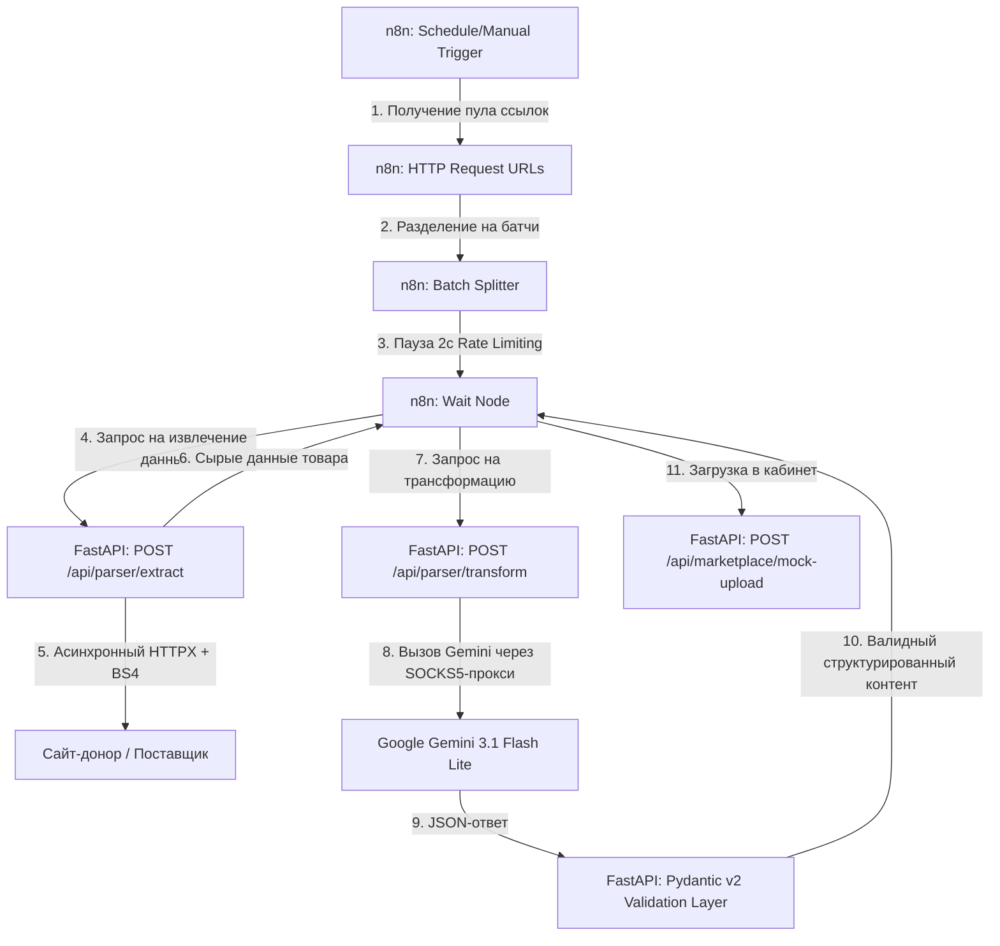

<<<<<<< HEAD
<div align="center">
  
</div>

<h1 align="center">
  🤖 Асинхронный ИИ-Парсер каталогов и ETL-конвейер для маркетплейсов
</h1>

=======
>>>>>>> 963ffb6 (Add .gitattributes, update README.md, add pipeline schema)
<p align="center">
  <div align="center">
    
    
    
    
    
    
  </div>
</p>

<h1 align="center">🤖 Асинхронный ИИ-Парсер каталогов и ETL-конвейер для маркетплейсов</h1>

<p align="center">
  <b>Промышленный отказоустойчивый B2B-пайплайн автоматизации e-commerce. Сквозная интеграция n8n + Python (FastAPI) + Google Gemini API для массового импорта и ИИ-уникализации контента.</b>
</p>

> **⚡ Ключевая бизнес-ценность:** Автоматизирует рутину контент-менеджеров по переносу товаров от поставщиков или конкурентов. Система берет на себя парсинг, обход блокировок, глубокий рерайт (удаление чужих брендов, SEO-насыщение) и подготовку валидных данных для загрузки в маркетплейс в один клик.

---

## 🏗 Архитектура Системы (System Design)

Пайплайн спроектирован по канонам событийно-ориентированной архитектуры (EDA) с разделением ответственности (Separation of Concerns): n8n отвечает за оркестрацию и временные задержки, а FastAPI-бэкенд — за вычислительные процессы (парсинг) и бизнес-логику ИИ-валидации.



---

## 💎 Промышленные B2B-стандарты проекта

### 1. Управление лимитами (Rate Limiting & Safety)

Большинство ИИ-провайдеров и API маркетплейсов имеют строгие ограничения на количество запросов в секунду (RPM/TPM), возвращая ошибку HTTP 429. В нашем n8n-сценарии реализован паттерн контролируемого батчинга:

- Данные разбиваются на изолированные батчи по **1 товару**.
- Между батчами установлена задержка в **2 секунды** через Wait Node, что гарантирует стабильную работу без блокировок ключей.

### 2. Изоляция ошибок (Error Isolation & Fail-Safety)

Сбой при парсинге одной битой ссылки или временный таймаут Gemini API не должны приводить к остановке всего ETL-процесса.

- В воркфлоу n8n для критических узлов активирована опция `continueOnFail: true`.
- Невалидные итерации логируются на стороне FastAPI-сервера, а конвейер беспрепятственно продолжает обработку оставшихся сотен товаров.

### 3. Сквозная поддержка SOCKS5/HTTP-прокси

Для стабильного доступа к API моделей Google Gemini из инфраструктуры РФ реализована встроенная поддержка сетевых прокси-серверов. Логика бэкенда автоматически прокидывает настройки прокси как в асинхронный клиент `httpx.AsyncClient` для парсинга сайтов, так и в SDK Gemini для генерации контента.

### 4. Строгий контракт данных (Pydantic v2 Validation)

Для исключения «галлюцинаций» языковых моделей и поломки структуры данных при импорте, бэкенд использует жесткую валидацию схемы ответа. Перед отправкой данных в маркетплейс, ИИ-ответ преобразуется в типизированный объект Pydantic:

```python
class CleanProductData(BaseModel):
    original_sku: str          # Уникальный артикул товара
    clean_title: str           # Заголовок (очищенный от чужих брендов, SEO-оптимизированный)
    clean_description: str     # Уникализированное описание товара
    extracted_specs: dict      # Структурированные технические характеристики
    media_urls: list[str]      # Ссылки на медиа-контент
```

---

## 🛠 Технологический стек

| Компонент | Технология | Назначение |
|-----------|-----------|-----------|
| **Оркестратор пайплайнов** | n8n (Self-hosted) | Визуальное проектирование сценариев, батчинг данных, управление очередью |
| **Бэкенд** | Python 3.11, FastAPI, Uvicorn | Асинхронная обработка сетевых запросов |
| **ИИ-ядро** | Google Gemini 3.1 Flash Lite API | Структурированная генерация контента (application/json) |
| **Парсинг и сеть** | BeautifulSoup4, httpx | Асинхронный клиент с поддержкой пула соединений |
| **Валидация** | Pydantic v2 | Строгие b2b-схемы данных на входе и выходе |

---

## 📡 Эндпоинты FastAPI

<<<<<<< HEAD
```
┌─────────────────────────────────────────────────────────────────────┐
│                         n8n Workflow                                │
│                                                                     │
│  ┌─────────┐   ┌──────────┐   ┌──────────────┐   ┌──────────────┐  │
│  │Schedule │──▶│  HTTP    │──▶│    Split     │──▶│    Wait      │  │
│  │Trigger  │   │  URLs    │   │  In Batches  │   │    2s        │  │
│  └─────────┘   └──────────┘   └──────┬───────┘   └──────────────┘  │
│                                       │                             │
│                          ┌────────────▼────────────┐               │
│                          │     Loop body (×N)      │               │
│                          │  ┌──────────────────┐  │               │
│                          │  │ HTTP Extract     │  │               │
│                          │  │ POST /extract    │  │               │
│                          │  └────────┬─────────┘  │               │
│                          │  ┌────────▼─────────┐  │               │
│                          │  │ HTTP Transform   │  │               │
│                          │  │ POST /transform  │  │               │
│                          │  └────────┬─────────┘  │               │
│                          │  ┌────────▼─────────┐  │               │
│                          │  │ HTTP Upload      │  │               │
│                          │  │ POST /mock-upload│  │               │
│                          │  └──────────────────┘  │               │
│                          └────────────────────────┘               │
└─────────────────────────────────────────────────────────────────────┘
```

### 📊 Бортовые логи сервера

При запуске воркфлоу бэкенд логирует каждый этап трансформации:

```text
2026-05-27 09:47:14 [INFO]  Marketplace ETL Pipeline starting up…
2026-05-27 09:47:14 [INFO]  Gemini: gemini-3.1-flash-lite | available: True
2026-05-27 09:47:14 [INFO]  Proxy: 95.164.111.230:9851

2026-05-27 09:48:01 [INFO]  === EXTRACT === https://books.toscrape.com/...
2026-05-27 09:48:01 [INFO]  Extract done: sku=SKU-260527-DF2Y85 title=Ноутбук Sony Model 5312

2026-05-27 09:48:02 [INFO]  === TRANSFORM === sku=SKU-260527-DF2Y85
2026-05-27 09:48:02 [INFO]  Transform done: clean_title=Ноутбук Премиум Model 5312

2026-05-27 09:48:02 [INFO]  === MOCK UPLOAD === sku=SKU-260527-DF2Y85
2026-05-27 09:48:03 [INFO]  Upload success: marketplace_id=wb_3492239
```
=======
| Метод | Эндпоинт | Описание | Входные данные | Выходные данные |
|-------|---------|---------|---------------|----------------|
| `POST` | `/api/parser/extract` | Асинхронный парсинг сырого контента со страницы донора | `{"url": "string"}` | `RawProductData` |
| `POST` | `/api/parser/transform` | Генерация SEO-контента и рерайт характеристик через Gemini | `RawProductData` | `CleanProductData` |
| `POST` | `/api/marketplace/mock-upload` | Симуляция отгрузки в API личного кабинета маркетплейса | `CleanProductData` | `UploadResponse` |
| `GET` | `/health` | Проверка доступности бэкенда и статуса подключения к Gemini | — | `{"status": "ok"}` |
>>>>>>> 963ffb6 (Add .gitattributes, update README.md, add pipeline schema)

---

## 💻 Быстрый старт

```bash
# 1. Клонирование репозитория
git clone https://github.com/lazmaksim2019-ops/marketplace-etl-pipeline.git
cd marketplace-etl-pipeline

# 2. Создание и активация окружения
python -m venv .venv
source .venv/bin/activate  # Для Linux/macOS
# .venv\Scripts\activate   # Для Windows

# 3. Установка зависимостей
pip install -r requirements.txt

# 4. Настройка переменных среды
cp .env.example .env
# Заполните в .env ваш GEMINI_API_KEY и параметры прокси-сервера

# 5. Запуск FastAPI сервера
uvicorn main:app --host 0.0.0.0 --port 8000 --reload
```

### Настройка n8n-сценария

1. Запустите n8n (локально или в облаке).
2. Создайте новый пустой сценарий (Workflow).
3. Откройте файл `marketplace_pipeline.json` из репозитория, скопируйте его содержимое.
4. Вставьте скопированный JSON прямо на холст n8n с помощью клавиш **Ctrl+V** (или **Cmd+V**). Пайплайн со всеми связями импортируется автоматически!

---

## 📁 Структура репозитория

```
marketplace-etl-pipeline/
├── .gitignore                 # Игнорируем .env, __pycache__, .venv
├── .env.example               # Шаблон переменных окружения (без секретов)
├── README.md                  # Документация (вы здесь)
├── rules.md                   # Протокол разработки ETL
├── requirements.txt           # Python-зависимости
├── main.py                    # FastAPI сервер (точка входа)
├── models.py                  # Pydantic v2 схемы данных
├── marketplace_pipeline.json  # n8n workflow (готов к импорту)
└── assets/                    # Визуальные материалы
    └── pipeline_schema.svg    # Архитектура пайплайна
```

---

## 📄 Лицензия

Распространяется под лицензией **MIT**. Смотрите файл `LICENSE` для деталей.

---

<p align="center">
  <strong>Сделано с ❤️ для селлеров маркетплейсов и автоматизации e-commerce</strong>
</p>
